# Kortex

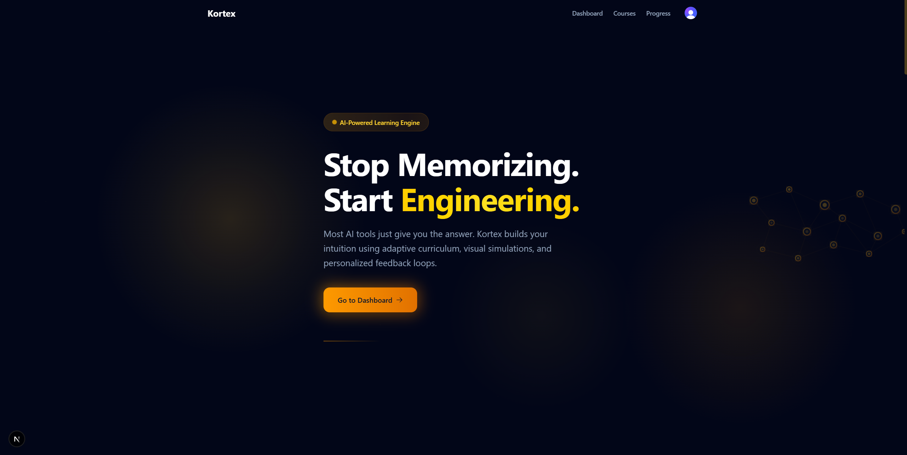

Kortex is an AI-assisted learning platform. An administrator supplies course
materials — PDFs, YouTube links, or just a topic and target audience — and a
background pipeline researches the subject, designs a curriculum following
Bloom's Taxonomy, writes each lesson with inline diagrams, and generates a
gatekeeper quiz per module. Learners work through the generated course one
module at a time, unlocking the next module only after passing its quiz.

The pipeline is subject-agnostic. The same code has generated working
courses in biology, genetics, web development, and machine learning without
any per-subject logic.

## Contents

- [How it works](#how-it-works)
- [Features](#features)
- [Architecture](#architecture)
- [Tech stack](#tech-stack)
- [Repository layout](#repository-layout)
- [Getting started](#getting-started)
- [Known limitations](#known-limitations)
- [Development notes](#development-notes)
- [License](#license)

## How it works

1. An admin creates a course: title, description, target audience, optional
   source materials (PDFs, YouTube links).
2. The Architect agent researches the topic (web search plus any supplied
   materials), then generates a full course structure — modules and lessons
   ordered by Bloom's Taxonomy level (Remember, Understand, Apply, Analyze,
   Evaluate, Create) — and a gatekeeper quiz outline per module.
3. The Author agent writes each lesson in parallel: MDX content with inline
   Mermaid diagrams and tables where they help, grounded in retrieved
   context from the research phase.
4. The Quizmaster generates the questions for each module's gatekeeper quiz.
5. Learners browse the catalog, enroll, and work through modules in order.
   A module's quiz must be passed before the next module unlocks. Progress,
   XP, streaks, and levels are tracked throughout.

All of this runs as a background job pipeline (see
[Architecture](#architecture)) so course generation for an 18-lesson course
takes a few minutes without blocking the admin's browser.

## Features

### Admin: course creation and live generation status

The admin supplies a title, description, target audience, and optional
source materials, then watches the pipeline work: module and lesson counts,
generation progress, and a live log of the web research each source query
performs.

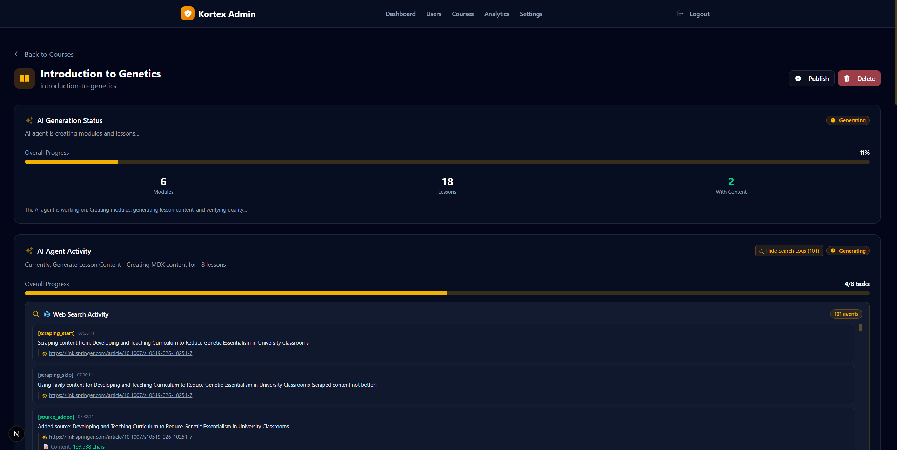

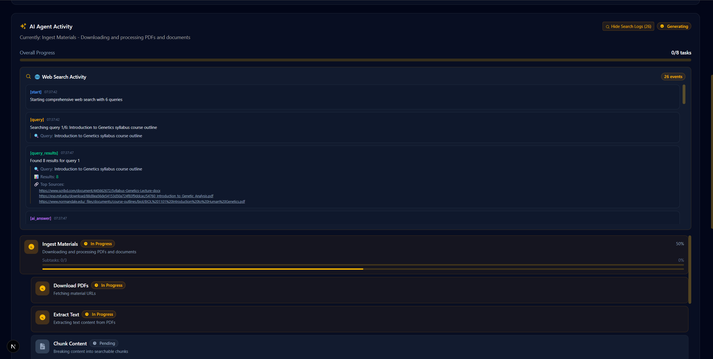

### Admin: course and content management

Every generated module and lesson is listed with its Bloom's level, and any
lesson's generated MDX content can be expanded and reviewed inline without
leaving the admin panel.

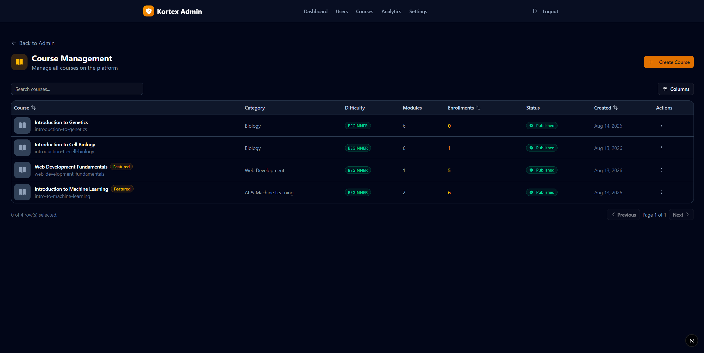

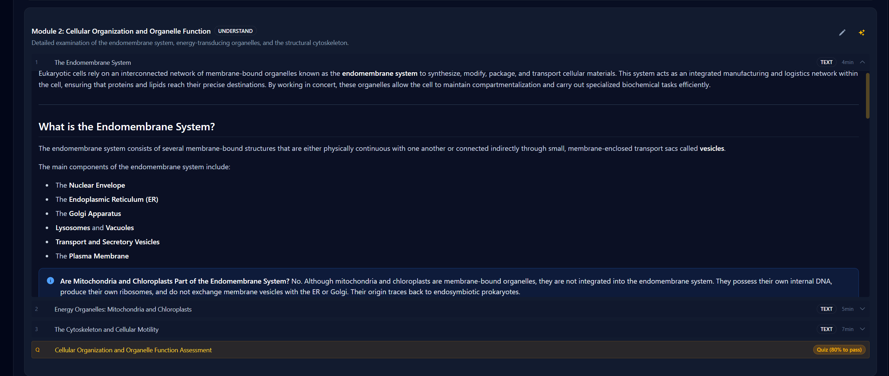

### Admin: analytics and user management

Platform-wide metrics (user growth, XP distribution, course popularity) and
per-user drill-down (XP, streak, badges, enrollment history, activity over
time).

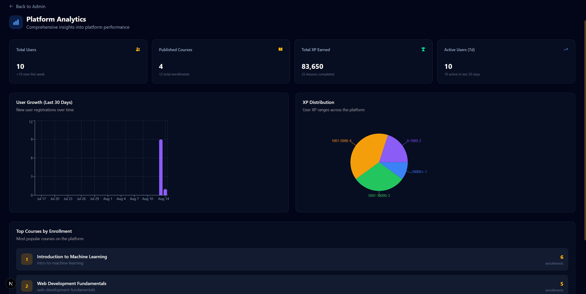

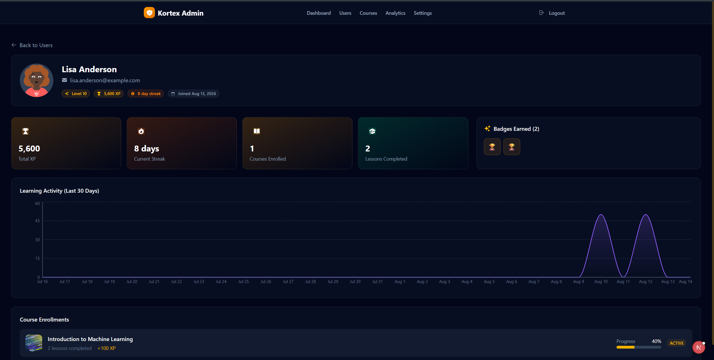

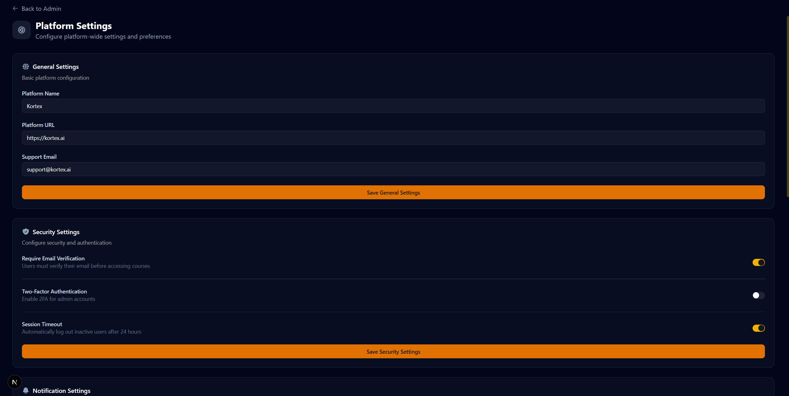

### Learner: course catalog and enrollment

Published courses are browsable and searchable by category. A course's
detail page shows its learning outcomes and full curriculum before a
learner commits to it.

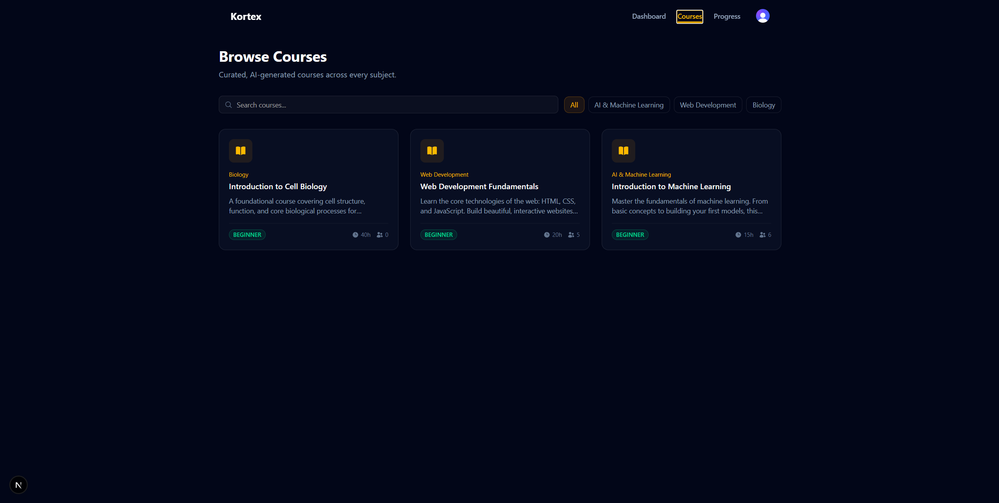

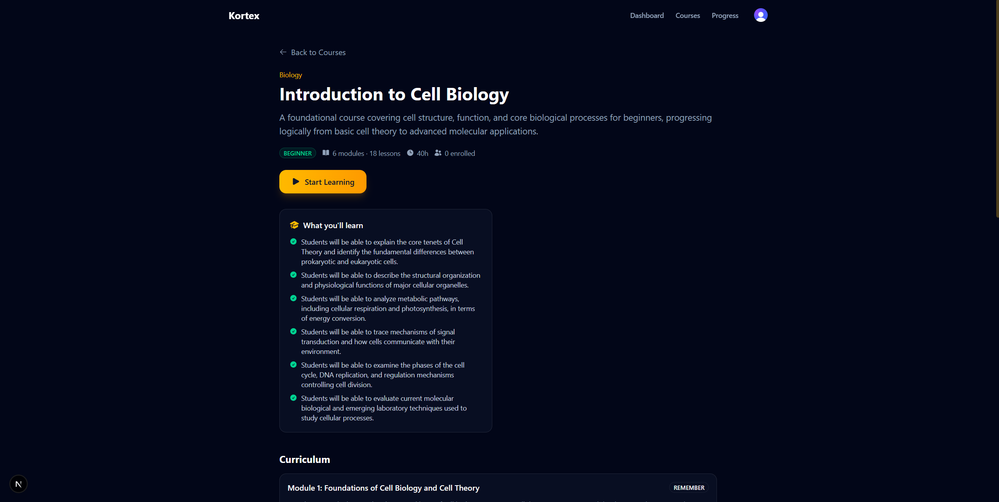

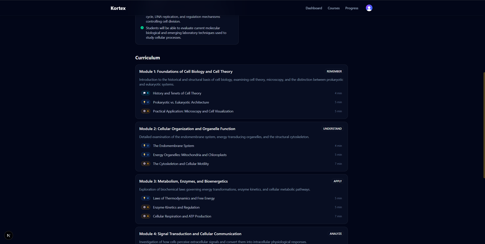

### Learner: lesson content with inline diagrams

Lessons render as formatted MDX: headings, tables, callouts, and Mermaid
diagrams (flowcharts, timelines, state diagrams, and more, chosen by the
model per lesson) generated inline as part of the content, not as a
separate asset.

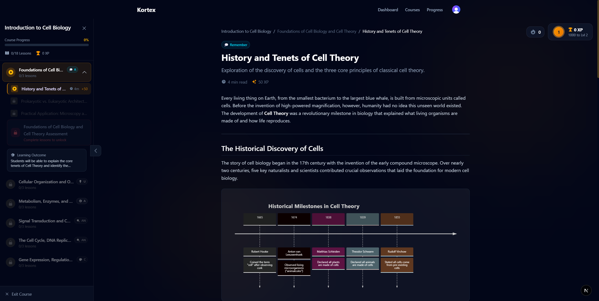

### Learner: gamification and progress tracking

XP, levels, streaks, and badges reward lesson completion, with a dashboard
summarizing progress, daily goals, and a leaderboard.

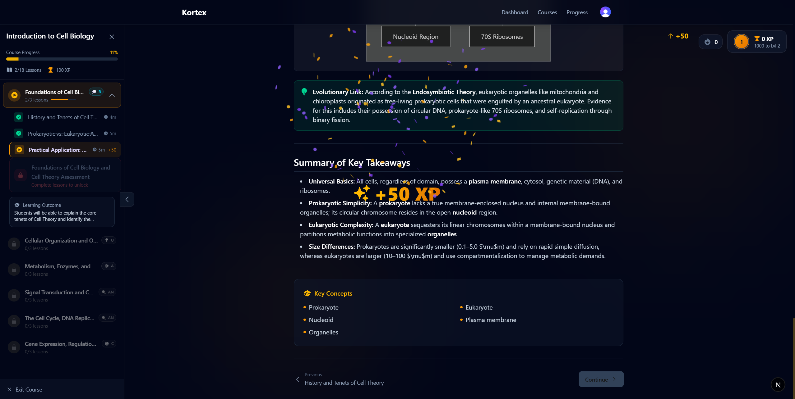

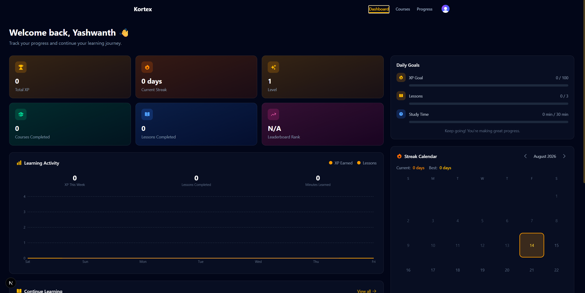

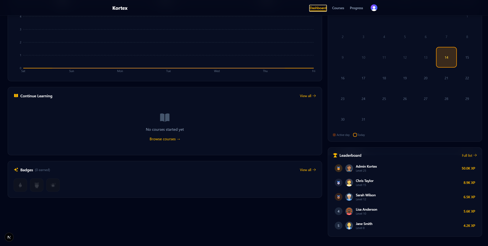

### Gatekeeper quizzes

Each module ends with a multiple-choice / true-false quiz generated
alongside its lessons. A learner must meet the module's passing score
before the next module unlocks — there is no screenshot for this flow yet,
but it is implemented and enforced both in the UI and on the server.

## Architecture

Kortex is a Turborepo monorepo with two independently deployable services
that communicate through Postgres and an event bus, not direct calls.

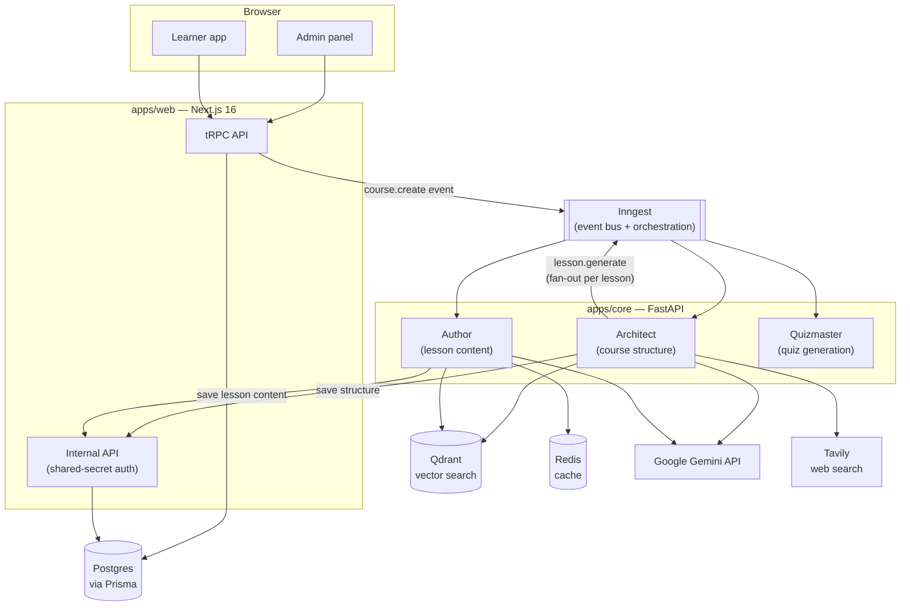

The course generation pipeline, end to end:

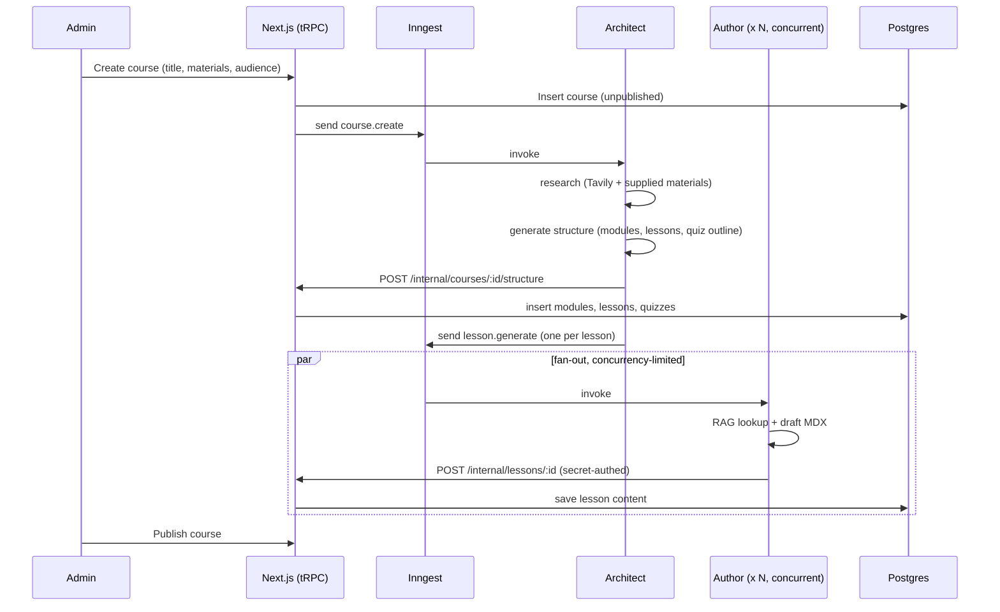

## Tech stack

**Frontend** (`apps/web`): Next.js 16 (App Router, Turbopack), React 19,
tRPC v11, Prisma v7 (driver adapters, no Rust engine), Clerk for learner
authentication, Tailwind CSS, Mermaid.js for diagram rendering, Motion and
GSAP for animation.

**Backend** (`apps/core`): Python, FastAPI, the Inngest Python SDK for
background job orchestration, the `google-genai` SDK for Gemini, Qdrant for
vector search, Redis for caching, Tavily for web research.

**Data**: PostgreSQL via Prisma (`packages/db`), a shared package consumed
by both the Next.js app directly and, indirectly, by the FastAPI service
through an internal HTTP API (Python has no Prisma client, so it writes
through Next.js rather than to Postgres directly).

**Infrastructure**: Docker Compose for local Postgres, Redis, Qdrant, and
the Inngest dev server. Turborepo and Bun manage the JS/TS workspaces; uv
manages the Python environment.

## Repository layout

```
kortex/
  apps/
    web/                 Next.js 16 app (admin panel + learner app)
      app/                Routes (App Router)
      components/         UI components
      server/trpc/         tRPC routers
      lib/                 Shared utilities (auth, Inngest event sending)
    core/                 FastAPI service
      app/
        inngest_functions/ Architect, Author — background pipeline
        agents/            Quizmaster and the delete-course-resources path
        routers/           Synchronous HTTP endpoints (storage, agents)
        clients/           Gemini, Qdrant, Redis clients
  packages/
    db/                  Prisma schema and generated client
    eslint-config/
    typescript-config/
  docker-compose.yml     Postgres, Redis, Qdrant, Inngest dev server
```

## Getting started

Prerequisites: Bun 1.3+, Python 3.13+ with uv, Docker.

```bash
git clone git@github.com:yash27007/kortex.git
cd kortex
bun install

# Start Postgres, Redis, Qdrant, and the Inngest dev server
docker compose up -d

# Push the Prisma schema
cd packages/db && bunx prisma db push && cd ../..
```

Each service reads its own `.env` file — there is no shared root `.env`
for application secrets.

`apps/core/.env`:

| Variable | Required | Notes |
|---|---|---|
| `GEMINI_API_KEY` | yes | [Google AI Studio](https://aistudio.google.com/apikey) |
| `TAVILY_KEY` | yes | Web research |
| `INTERNAL_API_SECRET` | yes | Must match `apps/web/.env.local` |
| `QDRANT_HOST` / `QDRANT_PORT` | no | Defaults match `docker-compose.yml` |
| `REDIS_HOST` / `REDIS_PORT` | no | Defaults match `docker-compose.yml` |

`apps/web/.env.local`:

| Variable | Required | Notes |
|---|---|---|
| `DATABASE_URL` | yes | Points at the Postgres container |
| `NEXT_PUBLIC_CLERK_PUBLISHABLE_KEY` / `CLERK_SECRET_KEY` | yes | [Clerk dashboard](https://dashboard.clerk.com) |
| `INTERNAL_API_SECRET` | yes | Must match `apps/core/.env` |
| `NEXT_PUBLIC_CORE_API_URL` | no | Defaults to `http://localhost:8000` |
| `ADMIN_EMAIL` / `ADMIN_PASSWORD` / `ADMIN_SECRET` | production only | See [Development notes](#development-notes) — a dev-only insecure default is used if unset |

`packages/db/.env`:

| Variable | Required |
|---|---|
| `DATABASE_URL` | yes |

Then run both services:

```bash
bun run dev   # apps/web on :3000, apps/core on :8000, via turbo
```

Visit `/admin/login` to create a course, and `/sign-up` to create a learner
account.

## Known limitations

This is an honest list, kept up to date rather than aspirational:

- **Admin "Regenerate module" is broken.** It calls a core API route that
  does not exist (`POST /agent/module`). Fails with a toast, does not
  corrupt any data.
- **AI field suggestions during course creation are broken** for the same
  reason (`POST /agent/suggestions` does not exist). Fails silently to an
  empty suggestion list.
- **The admin module editor's inline title/description "Save" is a stub.**
  It closes the edit form and shows a success toast without persisting a
  change.
- **No email or reminder system.** Scheduled study reminders were planned
  but never started.
- **No video generation (Manim).** Diagrams are Mermaid only, by design —
  see [Development notes](#development-notes).
- **Self-serve course creation does not exist.** Only an admin can create a
  course; there is no learner-facing "generate your own course" flow.
- **`apps/core/app/agents/architect.py` and `author.py`** are an older,
  pre-Inngest implementation of the same responsibilities as
  `inngest_functions/`. Only their course-deletion cleanup and an
  unreachable-outside-misconfigured-production fallback path are still
  wired in; they have not received the fixes made to the Inngest pipeline
  and should not be extended.

## Development notes

**AI assistance was used for frontend development only.** All backend
logic — the FastAPI service, the Inngest pipeline, the Prisma schema, and
the tRPC routers — was hand-written.

Admin credentials (`ADMIN_EMAIL`, `ADMIN_PASSWORD`, `ADMIN_SECRET`) fall
back to a documented, insecure development default if unset, so a fresh
clone runs without extra setup. In production (`NODE_ENV=production`) the
app refuses to start without these set explicitly — see
`apps/web/lib/admin-auth.ts`.

## License

Kortex is free software, licensed under the
[GNU General Public License v3.0](LICENSE) or later. You are free to use,
study, modify, and redistribute it, including commercially, as long as
derivative works remain licensed under the GPL.
